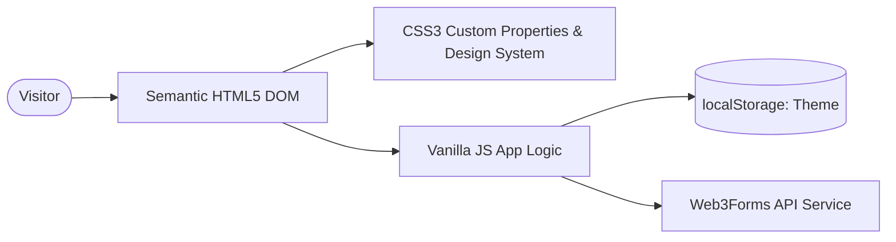

<div align="center">

# Aryan Sharma — Developer Portfolio

**Production Performance-Optimized Developer Portfolio & Engineering Showcase**

[](https://portfolio-amber-rho-jwa3w6ztpg.vercel.app)
[](https://github.com/aryansharma-prog/Portfolio)
[](LICENSE)

</div>

---

## 📌 Overview

A high-performance, responsive personal portfolio website engineered with zero framework overhead using native HTML5, modern CSS3 (Custom Properties & Flexbox/Grid), and Vanilla JavaScript. Built to showcase full-stack MERN projects, multi-agent AI systems, algorithmic competencies, and technical documentation with sub-second page loads.

---

## ⚡ Engineering Highlights

- 🚀 **Zero-Dependency Architecture**: Built without heavy frontend frameworks for ultra-lightweight asset delivery and optimal Lighthouse performance.
- 🌓 **Dynamic Theme Engine**: Smooth dark/light theme switching with `localStorage` persistence and CSS token variables.
- 📱 **Fluid Responsiveness**: Comprehensive viewport adaptation across mobile, tablet, laptop, and ultra-wide displays.
- 📬 **Asynchronous Form Pipeline**: Contact pipeline integrated with Web3Forms API including validation and async feedback.
- 📊 **Telemetry & Case Study Modals**: Interactive modal system for deep-dive architectural project reviews and live profile stats.

---

## 🏗️ Architecture



---

## 🛠️ Tech Stack

- **Markup & Layout**: Semantic HTML5, CSS3 Grid/Flexbox, Glassmorphic UI Tokens
- **Logic**: Vanilla JavaScript (ES6+ Modules, Fetch API, Intersection Observer)
- **Deployment**: Vercel (Static Web Hosting with Custom Header Caching)
- **Integration**: Web3Forms Public Access Key API

---

## 🚀 Local Development

```bash
# Serve locally using any static web server
npx serve .
# or
python3 -m http.server 3000
```
*Open `http://localhost:3000` in your browser.*

---

## 👨‍💻 Author

**Aryan Sharma**  
- Portfolio: [aryansharma.dev](https://portfolio-amber-rho-jwa3w6ztpg.vercel.app)  
- GitHub: [@aryansharma-prog](https://github.com/aryansharma-prog)  
- LinkedIn: [Aryan Sharma](https://linkedin.com/in/aryan-sharma-b9a4242a3)
